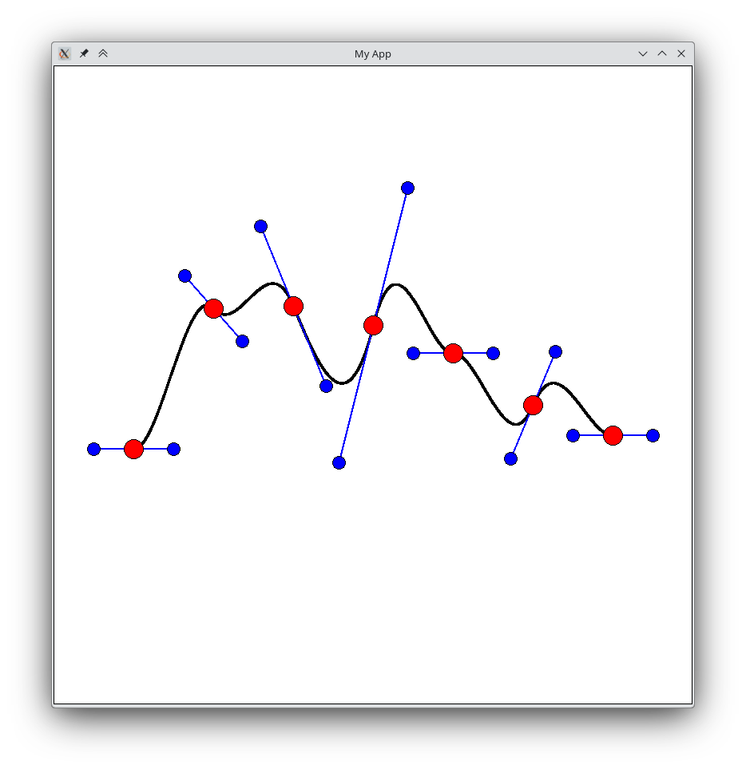

# Catmull-Rom Splines
## Intro

In this exercise, we will interpolate a set of random control points in order to generate a smooth path.

## Step 1: Generate control points

Generate a set of random points. You can use the <em>Point</em> class from the application template to represent the points. Every point will have two associated handle points, which will be used to control the curvature of the curve. The handle points are symmetrically distributed and can be positioned with the handleDx and handleDy properties of the Point class. Choose a fixed value for handleDx and 0 for handleDy when creating your points.

Now, draw all control points and the associated handle points. Also draw a line connecting the handle points. Make sure that you draw the points within the main loop of the application. This way, the app will be redrawn continuously and can be animated later.

## Step 2: Quadratic interpolation

Implement a function, which based on three control points computes the coefficients of the quadratic going through the control points. For this set up a linear equation system and and solve it with the help of NumPy.

Also implement a function to draw the quadratic curve. Test your implementation by drawing the quadratic curve through the first three control points.

## Step 3: Polynom interpolation

Generalize Step 2 to work with higher degree polynomials. For a polynom of degree <em>n</em> you need <em>n+1</em> points. Again, test your implementation by drawing the curve through the first <em>5</em> points. How do the curves change, the more points you add?

## Step 4: Catmull-Rom splines

 
Setup a linear equation system for all conditions of a Catmull-Rom spline. For every segment, you will get a system of four equations with four unknowns. Two equations for the y-coordinates of the control points and two equations for the slope at the control points. You may use the method <em>Point.m()</em> to get the slope from the handles at the control points. Solve the system with the help of NumPy.

Test your implementation and draw all cubic segments. Make sure that the segments are connected smoothly.

Add interactivity to your application and allow the user to move the control points and their handles. Make sure to update the path when the user changes the position of a control point.

